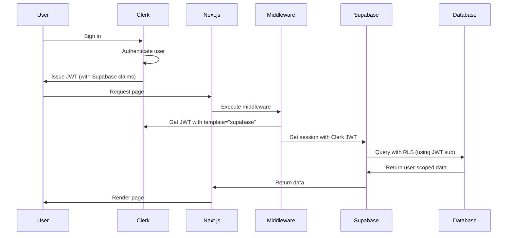

# AGENTS.md - MRKT Project

> **A README for AI Agents**: This file provides comprehensive context and instructions for AI coding agents working on the MRKT marketplace application.

---

## Table of Contents

1. [Project Overview](#project-overview)
2. [Architecture & Tech Stack](#architecture--tech-stack)
3. [Directory Structure](#directory-structure)
4. [Setup & Installation](#setup--installation)
5. [Testing Instructions](#testing-instructions) ⭐
6. [Linting & Static Analysis](#linting--static-analysis)
7. [Development Workflow](#development-workflow)
8. [Database Management](#database-management)
9. [Authentication & Authorization](#authentication--authorization)
10. [Security Best Practices](#security-best-practices)
11. [Code Style & Conventions](#code-style--conventions)
12. [Common Commands](#common-commands)
13. [Troubleshooting](#troubleshooting)
14. [Contributing Guidelines](#contributing-guidelines)

---

## Project Overview

**MRKT** is an anonymous marketplace platform for verified HBS students that enables transparent resale of club event tickets through hourly modified Dutch auctions.

### Key Features
- **Sellers**: Upload redacted QR tickets with price floors
- **Buyers**: Place bids with cards on file for instant, private matching
- **Auctions**: Automated Dutch auction mechanism with hourly price adjustments
- **Privacy**: Anonymous trading while maintaining student verification
- **Analytics**: Clubs receive privacy-safe demand insights for future pricing

### Business Context
The platform streamlines last-minute ticket trades within the HBS community while providing valuable market data to student organizations. All transactions maintain user privacy while ensuring only verified students can participate.

---

## Architecture & Tech Stack

### Frontend
- **Framework**: Next.js 16 (App Router, React 19)
- **Language**: TypeScript (strict mode)
- **Styling**: Tailwind CSS 4
- **Authentication**: Clerk (user management, JWT)
- **State Management**: React Context (SupabaseProvider)

### Backend
- **Database**: Supabase (PostgreSQL 17)
- **Storage**: Supabase Storage (QR code images)
- **Security**: Row Level Security (RLS) policies
- **Functions**: PostgreSQL RPC functions
- **Real-time**: Supabase Realtime (enabled)

### Development & Testing
- **Testing**: pgTAP (database tests) - 220 total tests
- **Linting**: ESLint 9 with Next.js config
- **Type Checking**: TypeScript compiler
- **CI/CD**: GitHub Actions

### Infrastructure
- **Local Development**: Supabase CLI (local database)
- **Production**: Supabase hosted project
- **Deployment**: Vercel (frontend), Supabase (backend)

---

## Directory Structure

```
MRKT-project/
├── .github/
│   └── workflows/          # CI/CD workflows
│       ├── db-test.yml     # Database tests on PRs
│       ├── db-test-manual.yml
│       └── db-deploy.yml   # Deploy migrations to prod
├── mrkt/                   # Next.js application
│   ├── app/                # Next.js App Router
│   │   ├── api/            # API routes (service role operations)
│   │   ├── layout.tsx      # Root layout with providers
│   │   ├── page.tsx        # Home page
│   │   └── globals.css     # Global styles
│   ├── lib/                # Shared utilities
│   │   └── supabase/       # Supabase client configuration
│   │       ├── client.ts           # Browser client (RLS-aware)
│   │       ├── middleware.ts       # Middleware client
│   │       └── server/             # Server-side clients
│   │           ├── index.ts        # Barrel export
│   │           ├── server.ts       # Server client (RLS-aware)
│   │           └── serviceClient.ts # Service role (bypasses RLS)
│   ├── providers/          # React context providers
│   │   └── supabase-provider.tsx
│   ├── middleware.ts       # Clerk + Supabase JWT sync
│   ├── eslint.config.mjs   # ESLint configuration
│   ├── tsconfig.json       # TypeScript configuration
│   ├── next.config.ts      # Next.js configuration
│   ├── tailwind.config.ts  # Tailwind configuration
│   └── package.json        # Frontend dependencies
├── supabase/               # Database & infrastructure
│   ├── migrations/         # SQL migrations (chronological)
│   │   ├── *_dbcore_schema.sql
│   │   ├── *_dbcore_rls.sql
│   │   ├── *_idb_rpc_surface.sql
│   │   ├── *_idb_rpc_functions.sql
│   │   └── *_storage_*.sql
│   ├── tests/              # pgTAP test suites
│   │   ├── 01_schema_pgtap.sql       # Schema validation (104 tests)
│   │   ├── 02_rls_pgtap.sql          # RLS policies (37 tests)
│   │   ├── 03_rpc_surface_pgtap.sql  # RPC interfaces (18 tests)
│   │   ├── 04_rpc_functions_pgtap.sql # RPC behavior (31 tests)
│   │   ├── 05_storage_pgtap.sql      # Storage policies (19 tests)
│   │   └── 06_servicekey_pgtap.sql   # Service role (11 tests)
│   ├── seed/               # Development seed data
│   │   └── 01_seed.sql
│   ├── config.toml         # Supabase configuration
│   └── README.md           # Detailed backend documentation
├── .env.example            # Environment variable template
├── .gitignore              # Git ignore rules
├── package.json            # Root package.json (database scripts)
├── README.md               # Human-readable project README
└── AGENTS.md               # This file
```

### Key Files to Know

- **`mrkt/middleware.ts`**: Syncs Clerk JWT with Supabase for RLS
- **`mrkt/lib/supabase/server/serviceClient.ts`**: Service role client (bypasses RLS)
- **`supabase/README.md`**: Comprehensive database documentation
- **`.github/workflows/db-test.yml`**: Automated test runner

---

## Setup & Installation

### Prerequisites
- Node.js 20+ (check with `node --version`)
- npm or yarn
- Supabase CLI (`npm install -g supabase` or `brew install supabase/tap/supabase`)
- Git

### Initial Setup

1. **Clone the repository**
   ```bash
   git clone <repository-url>
   cd MRKT-project
   ```

2. **Install dependencies**
   ```bash
   # Root dependencies (database scripts)
   npm install

   # Frontend dependencies
   cd mrkt
   npm install
   cd ..
   ```

3. **Set up environment variables**

   **Root `.env`** (for local Supabase):
   ```bash
   cp .env.example .env
   # Edit .env with your local Supabase credentials
   ```

   **Frontend `mrkt/.env.local`**:
   ```bash
   cp mrkt/.env.local.example mrkt/.env.local
   # Configure:
   # - NEXT_PUBLIC_SUPABASE_URL (get from `supabase status`)
   # - NEXT_PUBLIC_SUPABASE_ANON_KEY (get from `supabase status`)
   # - SUPABASE_SERVICE_ROLE_KEY (get from `supabase status`)
   # - NEXT_PUBLIC_CLERK_PUBLISHABLE_KEY (from Clerk dashboard)
   # - CLERK_SECRET_KEY (from Clerk dashboard)
   ```

4. **Start Supabase local instance**
   ```bash
   supabase start
   ```

   This will:
   - Start local PostgreSQL database (port 54322)
   - Start Supabase Studio (http://127.0.0.1:54323)
   - Apply all migrations
   - Load seed data
   - Display connection credentials

5. **Configure Clerk JWT template**

   Follow instructions in `supabase_clerk_build_instructions.md` to set up Clerk JWT with Supabase claims.

6. **Run database tests (verify setup)**
   ```bash
   npm run db:test
   ```

   Expected: All 220 tests pass ✅

7. **Start development server**
   ```bash
   cd mrkt
   npm run dev
   ```

   Open http://localhost:3000

---

## Testing Instructions

### Overview
MRKT uses pgTAP for comprehensive database testing with 220 tests across 6 test suites. All tests are automatically run in CI on pull requests that modify database code.

### Continuous Integration Plan

#### Automated Testing (GitHub Actions)
- **Trigger**: Pull requests affecting `supabase/**` or pushes to `main`
- **Workflow**: `.github/workflows/db-test.yml`
- **Process**:
  1. Checks out code
  2. Sets up Node.js 20 and Supabase CLI
  3. Starts local Supabase instance
  4. Runs `npm run db:test` (all database tests)
  5. Posts test results as PR comment
  6. Stops Supabase instance

#### Deployment Workflow
- **Trigger**: Pushes to `main` that modify `supabase/migrations/**`
- **Workflow**: `.github/workflows/db-deploy.yml`
- **Process**:
  1. Links to production Supabase project
  2. Pushes pending migrations
  3. Verifies migration status
  4. Creates deployment summary

**CI Test Results Format**:
```
✅ Database tests passed (220 tests)

- Schema: 104 tests
- RLS: 37 tests
- RPC Surface: 18 tests
- RPC Functions: 31 tests
- Storage: 19 tests
- Service Key: 11 tests
```

### How to Run Tests

#### All Database Tests (Recommended)
```bash
# From project root
npm run db:test
```

This command:
1. Resets database (applies all migrations + seed data)
2. Runs all test suites except storage and service key tests
3. Reports pass/fail for each test

#### All Tests Including Storage & Service Key
```bash
npm run db:test:all
```

Runs every test file in `supabase/tests/` directory.

#### Individual Test Suite
```bash
# Schema tests (104 tests)
supabase test db supabase/tests/01_schema_pgtap.sql

# RLS tests (37 tests)
supabase test db supabase/tests/02_rls_pgtap.sql

# RPC Surface tests (18 tests)
supabase test db supabase/tests/03_rpc_surface_pgtap.sql

# RPC Functions tests (31 tests)
supabase test db supabase/tests/04_rpc_functions_pgtap.sql

# Storage tests (19 tests)
supabase test db supabase/tests/05_storage_pgtap.sql

# Service Key tests (11 tests)
supabase test db supabase/tests/06_servicekey_pgtap.sql
```

#### Reset Database Before Testing
```bash
npm run db:reset
```

This applies all migrations and reloads seed data. Always run before manual testing to ensure clean state.

### Test Categories

#### 1. Schema Tests (`01_schema_pgtap.sql`) - 104 tests
- Table existence and structure
- Column definitions and constraints
- Primary keys and foreign keys
- Indexes and default values
- UUID generation functions
- Table relationships

**Coverage**: `users`, `events`, `asks`, `bids`, `matches`, `tickets`

#### 2. RLS Tests (`02_rls_pgtap.sql`) - 37 tests
- Row Level Security policy enforcement
- User-scoped access control
- Insert/update/delete permissions
- Policy correctness for each role

**Coverage**: All tables with RLS policies

#### 3. RPC Surface Tests (`03_rpc_surface_pgtap.sql`) - 18 tests
- RPC function signatures
- Parameter types and names
- Return types
- Function existence

**Coverage**: `rpc_create_event`, `rpc_create_ask`, `rpc_create_bid`, `rpc_get_book`, `rpc_mark_ticket_delivered`

#### 4. RPC Functions Tests (`04_rpc_functions_pgtap.sql`) - 31 tests
- RPC function behavior and logic
- Input validation
- Business rule enforcement
- Error handling

**Coverage**: Same functions as RPC Surface, testing actual execution

#### 5. Storage Tests (`05_storage_pgtap.sql`) - 19 tests
- Storage bucket configuration
- Access policies for QR code uploads
- Path validation helpers
- Upload/download/delete permissions

**Coverage**: `qr_codes` bucket

#### 6. Service Key Tests (`06_servicekey_pgtap.sql`) - 11 tests
- Service role bypasses RLS
- Authenticated users still restricted
- Privileged operations work correctly
- Regular users cannot perform admin tasks

**Coverage**: Service role vs authenticated role behavior

### Test Environment

**Database State**:
- Tests run against local Supabase instance
- Database is reset before test runs via `npm run db:reset`
- Seed data is loaded automatically
- Tests are wrapped in transactions (rolled back after execution)

**Isolation**:
- Each test file is independent
- Tests within a file share database state
- Use unique UUIDs to avoid conflicts

### When to Update Tests

#### ✅ Add New Tests When:
1. **Creating new migrations**
   - Add schema tests for new tables/columns
   - Add RLS tests for new policies
   - Example: New table → Update `01_schema_pgtap.sql`

2. **Adding RPC functions**
   - Add surface tests (function signature)
   - Add behavior tests (function logic)
   - Example: New RPC → Update `03_rpc_surface_pgtap.sql` and `04_rpc_functions_pgtap.sql`

3. **Modifying storage policies**
   - Add tests for new bucket policies
   - Test upload/download/delete permissions
   - Example: New bucket → Update `05_storage_pgtap.sql`

4. **Adding service role operations**
   - Add tests verifying RLS bypass
   - Add tests verifying regular user restrictions
   - Example: New privileged operation → Update `06_servicekey_pgtap.sql`

5. **Changing business rules**
   - Update RPC function tests to match new logic
   - Add tests for edge cases
   - Example: New validation rule → Update `04_rpc_functions_pgtap.sql`

#### 🔄 Update Existing Tests When:
1. **Fixing bugs in tests themselves**
   - Test had incorrect assertion
   - Test used wrong expected value
   - User explicitly requests test modification

2. **Intentionally changing schema/behavior**
   - Renaming columns → Update schema tests
   - Changing RLS policies → Update RLS tests
   - Modifying RPC logic → Update RPC tests

### Test Preservation Rules

> **⚠️ CRITICAL: DO NOT CHANGE EXISTING TESTS UNLESS EXPLICITLY REQUESTED BY USER**

**Why This Matters**:
- Existing tests document expected behavior and serve as regression prevention
- Changing tests can hide bugs or breaking changes
- Tests should only change when the intended behavior changes

**Rules**:
1. **Default Action**: Add new tests rather than modifying existing ones
2. **Only Modify Tests When**:
   - User explicitly requests: "change test X to Y"
   - Fixing an obvious bug in the test itself (wrong UUID format, typo)
   - Schema/behavior intentionally changed via migration
3. **Never Modify Tests To**:
   - Make them pass when they're failing
   - Hide breaking changes
   - Skip difficult test cases

**Example - Correct Approach**:
```
❌ Wrong: Test is failing → Modify test to pass
✅ Right: Test is failing → Fix the code to match test expectation
✅ Right: Test is failing → Ask user if behavior should change
```

### Running Tests in Development

**Before Committing**:
```bash
# Reset database and run all tests
npm run db:test

# Expected output: "ok X - test description" for each test
# All tests should pass
```

**After Creating Migration**:
```bash
# Apply migration
npm run db:reset

# Run relevant test suite
supabase test db supabase/tests/01_schema_pgtap.sql

# If adding RPC, also run:
supabase test db supabase/tests/03_rpc_surface_pgtap.sql
supabase test db supabase/tests/04_rpc_functions_pgtap.sql
```

**Debugging Failed Tests**:
```bash
# Run individual test file
supabase test db supabase/tests/02_rls_pgtap.sql

# Check psql output for detailed error messages
# Look for "not ok" lines and DETAIL messages
```

### Test Failure Response

**When Tests Fail**:
1. Read the failure message carefully
2. Identify which test failed (look for "not ok" lines)
3. Check if the failure is expected (new feature not yet implemented)
4. Fix the code or migration to satisfy the test
5. Re-run tests to verify fix

**Do NOT**:
- Modify the test to make it pass (unless explicitly requested)
- Comment out failing tests
- Skip test suites
- Commit code with failing tests

---

## Linting & Static Analysis

### ESLint (Code Quality)

**Run Linter**:
```bash
cd mrkt
npm run lint
```

**Configuration**: `mrkt/eslint.config.mjs`

**Rules**:
- Next.js recommended rules (`eslint-config-next/core-web-vitals`)
- TypeScript rules (`eslint-config-next/typescript`)
- Custom ignores: `.next/`, `out/`, `build/`, `next-env.d.ts`

**What ESLint Checks**:
- React Hooks rules
- Next.js best practices (Image, Link, Script usage)
- Import order
- Unused variables
- Missing dependencies in useEffect

**Auto-fix Issues**:
```bash
cd mrkt
npm run lint -- --fix
```

### TypeScript Type Checking

**Run Type Checker**:
```bash
cd mrkt
npx tsc --noEmit
```

**Configuration**: `mrkt/tsconfig.json`

**Compiler Options**:
- `strict: true` - All strict checks enabled
- `noEmit: true` - Type check only, no JS output
- `esModuleInterop: true` - CJS/ESM compatibility
- Path aliases: `@/*` → `./mrkt/*`

**What TypeScript Checks**:
- Type errors and mismatches
- Missing type annotations
- Undefined variables
- Incorrect function signatures
- Type safety violations

### Pre-Commit Checklist

Before committing, ensure:
1. ✅ `npm run lint` passes (from `mrkt/` directory)
2. ✅ `npx tsc --noEmit` passes (from `mrkt/` directory)
3. ✅ `npm run db:test` passes (from root directory)
4. ✅ `npm run build` succeeds (from `mrkt/` directory)

### Build Validation

**Production Build**:
```bash
cd mrkt
npm run build
```

This runs:
- TypeScript compilation
- ESLint checks
- Next.js build optimization
- Page generation

**Expected Output**:
```
✓ Compiled successfully
✓ Linting and checking validity of types
✓ Creating an optimized production build
```

**Build Errors**:
- Type errors → Fix TypeScript issues
- Lint errors → Run `npm run lint -- --fix`
- Build errors → Check console for specific issue

---

## Development Workflow

### Branch Strategy

**Main Branches**:
- `main` - Production-ready code, protected
- `feature/*` - Feature development branches

**Branch Naming**:
- Feature: `feature/ticket-auction-logic`
- Bugfix: `bugfix/fix-bid-validation`
- Database: `db/add-user-ratings`
- Homework: `linsdell-shivamparikh-hw8` (team assignments)

**Workflow**:
1. Create feature branch from `main`
2. Develop and test locally
3. Commit with descriptive messages
4. Push and create PR
5. CI runs database tests
6. Review and merge to `main`
7. Deployment to production (auto or manual)

### Commit Message Conventions

**Format**: `MRK-[number]: Brief description`

**Examples**:
```
MRK-7: Add Supabase client SDK with RLS support
MRK-9: Configure Clerk JWT edge middleware
MRK-30: Implement storage with RLS for QR codes
MRK-5: Configure secure service-role access
```

**Structure**:
- `MRK-#` prefix references Linear ticket number
- Brief (50-72 chars) description
- Use imperative mood: "Add" not "Added"
- Explain *what* and *why*, not *how*

**Commit Best Practices**:
- One logical change per commit
- All tests pass before committing
- Include migration + tests in same commit
- Descriptive commit messages

### Pull Request Process

**Creating PR**:
1. Ensure all tests pass locally
2. Push branch to remote
3. Create PR with description of changes
4. Link to Linear ticket if applicable
5. Add reviewers

**PR Description Should Include**:
- Summary of changes
- Testing performed
- Screenshots (if UI changes)
- Migration details (if database changes)
- Breaking changes (if any)

**PR Checks**:
- ✅ Database tests (if `supabase/**` changed)
- ✅ Build succeeds
- ✅ No merge conflicts
- ✅ Reviewers approve

**Merging**:
- Squash and merge (for feature branches)
- Keep commit history clean
- Delete branch after merge

---

## Database Management

### Migration Workflow

#### Creating a New Migration

1. **Generate migration file**:
   ```bash
   supabase migration new descriptive_name
   ```

   Example: `supabase migration new add_user_ratings`

   Creates: `supabase/migrations/YYYYMMDDHHMMSS_descriptive_name.sql`

2. **Write SQL**:
   ```sql
   -- Add your schema changes, RLS policies, etc.
   CREATE TABLE public.ratings (
     id uuid PRIMARY KEY DEFAULT gen_random_uuid(),
     user_id uuid REFERENCES public.users(id) NOT NULL,
     rating integer CHECK (rating BETWEEN 1 AND 5),
     created_at timestamptz DEFAULT now()
   );

   -- Enable RLS
   ALTER TABLE public.ratings ENABLE ROW LEVEL SECURITY;

   -- Add policies
   CREATE POLICY "Users can view their own ratings"
     ON public.ratings FOR SELECT
     USING (auth.uid() = user_id);
   ```

3. **Apply migration locally**:
   ```bash
   npm run db:reset
   ```

4. **Add tests** (see [Testing Instructions](#testing-instructions))

5. **Verify**:
   ```bash
   npm run db:test
   ```

#### Migration Naming Conventions

**Pattern**: `YYYYMMDDHHMMSS_category_description.sql`

**Categories**:
- `dbcore_*` - Core schema changes
- `idb_*` - Interface/RPC functions
- `fix_*` - Bug fixes
- `storage_*` - Storage bucket changes
- `add_*` - New features
- `remove_*` - Deprecations

**Examples**:
- `20251027131047_dbcore_schema.sql`
- `20251027170424_idb_rpc_surface.sql`
- `20251102202700_storage_qr_codes_bucket.sql`

#### Applying Migrations

**Local Development**:
```bash
# Reset database (reapply all migrations + seed)
npm run db:reset

# Migrations are applied in chronological order
# Seed data loaded after migrations
```

**Production**:
```bash
# Push pending migrations (manual)
npm run db:push

# Or let GitHub Actions deploy on merge to main
# (see .github/workflows/db-deploy.yml)
```

#### Rolling Back Migrations

**Local**:
```bash
# Reset to clean state
supabase db reset

# Or manually delete migration file before reset
rm supabase/migrations/YYYYMMDDHHMMSS_problematic.sql
npm run db:reset
```

**Production**:
- Create a new migration that reverts changes
- Never edit or delete existing migrations in production
- Use `ALTER TABLE ... DROP COLUMN` or similar SQL

### Database Inspection

**Supabase Studio** (GUI):
```bash
supabase start
# Open http://127.0.0.1:54323
```

Use Studio to:
- Browse tables and data
- Execute SQL queries
- View RLS policies
- Test storage buckets
- Monitor logs

**psql** (CLI):
```bash
# Connect to local database
supabase db psql

# Run queries
SELECT * FROM public.users;
\dt public.*  -- List tables
\d+ public.users  -- Describe table
```

### Seed Data

**Location**: `supabase/seed/01_seed.sql`

**Contents**:
- 2 test users (seller, buyer)
- 1 test event
- 1 test ask (open)
- 1 test bid (open)

**Usage**:
- Automatically loaded during `npm run db:reset`
- Use for local development and testing
- Update when schema changes require new seed data

**Adding Seed Data**:
```sql
-- Example: Add new test user
INSERT INTO public.users (id, email, first_name, last_name)
VALUES (
  '33333333-3333-3333-3333-333333333333',
  'newuser@example.com',
  'New',
  'User'
);
```

---

## Authentication & Authorization

### Authentication Flow (Clerk → Supabase)

**Overview**:
1. User signs in via Clerk (frontend)
2. Clerk issues JWT with Supabase claims
3. Middleware syncs Clerk JWT with Supabase session
4. Supabase RLS uses JWT for access control

**Detailed Flow**:



**Key Components**:
- `mrkt/middleware.ts` - Syncs Clerk JWT with Supabase
- Clerk JWT template named "supabase" - Contains `sub` (user ID)
- `auth.uid()` in RLS policies - Extracts user ID from JWT

### Supabase Client Types

#### 1. Browser Client (Client Components)

**File**: `mrkt/lib/supabase/client.ts`

**Usage**:
```typescript
'use client'
import { useSupabase } from '@/providers/supabase-provider'

export function MyComponent() {
  const supabase = useSupabase()

  // Query with RLS - only sees user's own data
  const { data } = await supabase
    .from('asks')
    .select('*')
}
```

**Characteristics**:
- RLS-aware (uses Clerk JWT from middleware)
- Automatic token refresh
- User-scoped access only
- Safe to use in browser

#### 2. Server Client (Server Components, API Routes)

**File**: `mrkt/lib/supabase/server/server.ts`

**Usage**:
```typescript
import { createServerClient } from '@/lib/supabase/server'
import { cookies } from 'next/headers'

export default async function Page() {
  const cookieStore = await cookies()
  const supabase = createServerClient(cookieStore)

  const { data } = await supabase.from('events').select('*')
  return <div>{/* render */}</div>
}
```

**Characteristics**:
- RLS-aware (uses Clerk JWT from middleware)
- SSR-safe cookie handling
- User-scoped access only
- Three variants: `createServerClient`, `createRouteHandlerClient`, `createServerActionClient`

#### 3. Service Role Client (Privileged Operations)

**File**: `mrkt/lib/supabase/server/serviceClient.ts`

**Usage**:
```typescript
// app/api/auction/route.ts
import { getServiceClient } from '@/lib/supabase/server'

export async function POST() {
  const supabase = getServiceClient({
    functionName: 'auction-engine',
    traceId: crypto.randomUUID()
  })

  // Insert match (bypasses RLS)
  const { data } = await supabase
    .from('matches')
    .insert({
      ask_id: '...',
      bid_id: '...',
      clearing_price_cents: 5000,
      qty: 1
    })

  return Response.json({ data })
}
```

**Characteristics**:
- **Bypasses ALL RLS policies** ⚠️
- Full database access
- Server-only (throws error if imported in browser)
- Automatic logging for audit trail
- Use only for: auction engine, delivery jobs, admin operations

**When to Use Each Client**:
- **Browser Client**: User-initiated actions (create ask/bid, view own data)
- **Server Client**: SSR pages, user-scoped API routes
- **Service Role Client**: System operations (match creation, ticket delivery, analytics)

### Row Level Security (RLS)

**Policy Overview**:

| Table | SELECT | INSERT | UPDATE | DELETE |
|-------|--------|--------|--------|--------|
| `users` | Own profile | N/A | Own profile | N/A |
| `events` | All authenticated | Event creator | Event creator | N/A |
| `asks` | All authenticated | Own (as seller) | Own (if open) | N/A |
| `bids` | All authenticated | Own (as buyer) | Own (if open) | N/A |
| `matches` | All authenticated | ❌ Service role only | ❌ No updates | N/A |
| `tickets` | Winner or seller | ❌ Service role only | Winner or seller | N/A |

**Key Points**:
- ✅ Users can view market data (transparency)
- ✅ Users can only manage their own asks/bids
- ❌ Users cannot create matches (auction engine only)
- ❌ Users cannot create tickets (system-generated)
- ✅ Users can update ticket delivery status if involved

**Testing RLS**:
See `supabase/tests/02_rls_pgtap.sql` for comprehensive RLS tests.

---

## Security Best Practices

### Service Role Key Protection

> **⚠️ CRITICAL: Service role key has superuser privileges. Misuse can compromise entire database.**

**Rules**:
1. **NEVER expose to client**:
   - ❌ Don't include in `NEXT_PUBLIC_*` variables
   - ❌ Don't send to browser in API responses
   - ❌ Don't log the key value
   - ❌ Don't commit to git (`.env` is gitignored)

2. **Server-only imports**:
   ```typescript
   // ❌ WRONG - Will throw error
   'use client'
   import { getServiceClient } from '@/lib/supabase/server/serviceClient'

   // ✅ CORRECT - Server component or API route
   import { getServiceClient } from '@/lib/supabase/server/serviceClient'
   ```

3. **Validate all inputs**:
   ```typescript
   export async function POST(request: Request) {
     const body = await request.json()

     // Validate BEFORE using service client
     if (!body.askId || !body.bidId) {
       return Response.json({ error: 'Invalid input' }, { status: 400 })
     }

     const supabase = getServiceClient({ functionName: 'auction' })
     // ... safe to proceed
   }
   ```

4. **Use context for audit logging**:
   ```typescript
   const supabase = getServiceClient({
     functionName: 'auction-engine',
     traceId: request.headers.get('x-request-id') || crypto.randomUUID()
   })
   ```

**Service Role Logging**:
All operations logged with format:
```
[service-role] 2024-11-03T10:30:45.123Z | Function: auction-engine | Trace: uuid-... | Operation: RPC: rpc_create_match | Details: {"params":{...}}
```

### Input Validation

**Always validate**:
- User IDs (check format, not empty)
- Prices (positive integers, within bounds)
- Quantities (positive integers)
- Event IDs (exist in database)
- File uploads (size, type, content)

**Example**:
```typescript
function validateAskInput(input: unknown): input is AskInput {
  if (typeof input !== 'object' || input === null) return false

  const { eventId, priceFloorCents, qty } = input as any

  return (
    typeof eventId === 'string' &&
    typeof priceFloorCents === 'number' && priceFloorCents > 0 &&
    typeof qty === 'number' && qty > 0
  )
}
```

### Client Selection

**Decision Tree**:
```
Is this operation in the browser?
├─ Yes → Use Browser Client (via useSupabase hook)
└─ No → Is this a server component/API route?
    ├─ Yes → Does it need to bypass RLS?
    │   ├─ Yes → Use Service Role Client
    │   └─ No → Use Server Client
    └─ No → Error (wrong context)
```

**Examples**:

```typescript
// Browser: User creates an ask
'use client'
const supabase = useSupabase()
await supabase.rpc('rpc_create_ask', { ... })

// Server: User views their dashboard (RLS applies)
const supabase = createServerClient(await cookies())
await supabase.from('asks').select('*')

// Service Role: Auction engine creates match (bypasses RLS)
const supabase = getServiceClient({ functionName: 'auction-engine' })
await supabase.from('matches').insert({ ... })
```

### Environment Variables

**Public Variables** (safe in browser):
- `NEXT_PUBLIC_SUPABASE_URL`
- `NEXT_PUBLIC_SUPABASE_ANON_KEY`
- `NEXT_PUBLIC_CLERK_PUBLISHABLE_KEY`

**Private Variables** (server-only):
- `SUPABASE_SERVICE_ROLE_KEY` ⚠️
- `CLERK_SECRET_KEY`
- `SUPABASE_ACCESS_TOKEN` (CI/CD)
- `SUPABASE_DB_PASSWORD` (CI/CD)

**Verification**:
```bash
# Check .gitignore includes .env files
cat .gitignore | grep ".env"

# Expected output:
# .env
# .env.*
# !.env.example
# !.env.local.example
```

---

## Code Style & Conventions

### TypeScript

**Strict Mode**:
- All strict checks enabled (`strict: true`)
- No implicit `any`
- Strict null checks
- Strict function types

**Type Definitions**:
```typescript
// Prefer interfaces for object shapes
interface User {
  id: string
  email: string
  firstName: string
  lastName: string
}

// Use type for unions/intersections
type Status = 'open' | 'matched' | 'cancelled'
type UserWithTimestamps = User & { createdAt: Date; updatedAt: Date }
```

**Naming Conventions**:
- PascalCase: Components, interfaces, types
- camelCase: Variables, functions, props
- SCREAMING_SNAKE_CASE: Constants
- snake_case: Database columns (SQL)

### React Components

**Server Components** (default):
```typescript
// No 'use client' directive
export default async function EventsPage() {
  const supabase = createServerClient(await cookies())
  const { data: events } = await supabase.from('events').select('*')

  return <EventList events={events} />
}
```

**Client Components** (interactive):
```typescript
'use client'
import { useSupabase } from '@/providers/supabase-provider'
import { useState } from 'react'

export function CreateAskForm() {
  const [price, setPrice] = useState('')
  const supabase = useSupabase()

  async function handleSubmit() {
    await supabase.rpc('rpc_create_ask', { priceFloorCents: parseInt(price) })
  }

  return <form onSubmit={handleSubmit}>...</form>
}
```

**File Organization**:
- One component per file
- Co-locate related components
- Use `index.ts` for barrel exports (sparingly)

### API Routes

**Structure**:
```typescript
// app/api/auction/route.ts
import { getServiceClient } from '@/lib/supabase/server'
import { NextRequest, NextResponse } from 'next/server'

export async function POST(request: NextRequest) {
  try {
    // 1. Parse and validate input
    const body = await request.json()
    validateInput(body) // Throws if invalid

    // 2. Get appropriate client
    const supabase = getServiceClient({
      functionName: 'auction-api',
      traceId: request.headers.get('x-request-id')
    })

    // 3. Perform operation
    const result = await performAuction(supabase, body)

    // 4. Return response
    return NextResponse.json({ data: result })
  } catch (error) {
    console.error('Auction error:', error)
    return NextResponse.json(
      { error: 'Failed to run auction' },
      { status: 500 }
    )
  }
}
```

**Best Practices**:
- Always validate input
- Use try-catch for error handling
- Return appropriate status codes
- Log errors with context

### Database Conventions

**Table Names**: `snake_case`, plural
- ✅ `users`, `events`, `asks`, `bids`
- ❌ `User`, `event`, `Ask`

**Column Names**: `snake_case`
- ✅ `created_at`, `price_floor_cents`, `seller_id`
- ❌ `createdAt`, `priceFloorCents`, `sellerId`

**Primary Keys**: `id uuid PRIMARY KEY DEFAULT gen_random_uuid()`

**Foreign Keys**: `{table}_id`
- Example: `seller_id` references `users(id)`

**Timestamps**: Always include
```sql
created_at timestamptz DEFAULT now() NOT NULL,
updated_at timestamptz DEFAULT now() NOT NULL
```

**Enums**: Use CHECK constraints
```sql
status text CHECK (status IN ('open', 'matched', 'cancelled')) NOT NULL DEFAULT 'open'
```

---

## Common Commands

### Development

| Command | Description |
|---------|-------------|
| `npm run dev` | Start Next.js dev server (from `mrkt/`) |
| `supabase start` | Start local Supabase instance |
| `supabase stop` | Stop local Supabase instance |
| `supabase status` | Show local Supabase connection info |
| `npm run build` | Build Next.js for production (from `mrkt/`) |

### Database

| Command | Description |
|---------|-------------|
| `npm run db:reset` | Reset database (apply migrations + seed) |
| `npm run db:test` | Run database tests (4 main suites) |
| `npm run db:test:all` | Run all database tests (6 suites) |
| `npm run db:push` | Push migrations to production |
| `supabase migration new <name>` | Create new migration file |
| `supabase db psql` | Connect to local database with psql |
| `supabase db diff` | Generate migration from schema changes |

### Testing & Quality

| Command | Description |
|---------|-------------|
| `npm run lint` | Run ESLint (from `mrkt/`) |
| `npm run lint -- --fix` | Auto-fix ESLint issues (from `mrkt/`) |
| `npx tsc --noEmit` | Run TypeScript type checking (from `mrkt/`) |
| `supabase test db <file>` | Run specific test file |

### Git

| Command | Description |
|---------|-------------|
| `git checkout -b feature/my-feature` | Create feature branch |
| `git add .` | Stage all changes |
| `git commit -m "MRK-#: Description"` | Commit with message |
| `git push -u origin feature/my-feature` | Push branch to remote |
| `git log --oneline -10` | View recent commits |

### Supabase Studio

| URL | Description |
|-----|-------------|
| http://127.0.0.1:54323 | Supabase Studio (local) |
| http://127.0.0.1:54321 | Supabase API (local) |
| http://127.0.0.1:54324 | Inbucket (email testing) |

---

## Troubleshooting

### Database Connection Issues

**Problem**: Cannot connect to Supabase

**Solutions**:
```bash
# Check if Supabase is running
supabase status

# If not running, start it
supabase start

# If port conflicts, check config.toml
cat supabase/config.toml | grep port

# Check environment variables
echo $NEXT_PUBLIC_SUPABASE_URL
echo $NEXT_PUBLIC_SUPABASE_ANON_KEY
```

### Test Failures

**Problem**: Database tests failing

**Solutions**:
```bash
# Reset database to clean state
npm run db:reset

# Run specific test to see detailed error
supabase test db supabase/tests/02_rls_pgtap.sql

# Check for migration conflicts
supabase migration list

# Verify seed data loaded
supabase db psql
SELECT * FROM public.users;
```

### Auth Sync Issues

**Problem**: Clerk JWT not syncing with Supabase

**Solutions**:
1. Verify Clerk JWT template is named "supabase"
2. Check template includes `sub` claim
3. Verify middleware is configured correctly
4. Check browser console for auth errors
5. Test with `supabase auth debug` (if available)

**Debug Middleware**:
```typescript
// Add logging to middleware.ts
console.log('Clerk userId:', userId)
console.log('Clerk token:', token)
console.log('Supabase session:', await supabase.auth.getSession())
```

### Build Errors

**Problem**: Next.js build failing

**Solutions**:
```bash
# Clear Next.js cache
rm -rf mrkt/.next

# Reinstall dependencies
cd mrkt
rm -rf node_modules package-lock.json
npm install

# Check for TypeScript errors
npx tsc --noEmit

# Check for ESLint errors
npm run lint

# Build again
npm run build
```

### Service Role Client Errors

**Problem**: "Service client can only be used in server-side code"

**Cause**: Imported service client in client component

**Solution**:
```typescript
// ❌ WRONG
'use client'
import { getServiceClient } from '@/lib/supabase/server/serviceClient'

// ✅ CORRECT - Move to API route
// app/api/my-operation/route.ts
import { getServiceClient } from '@/lib/supabase/server/serviceClient'

export async function POST() {
  const supabase = getServiceClient({ functionName: 'my-operation' })
  // ...
}
```

### Migration Conflicts

**Problem**: Migration fails to apply

**Solutions**:
```bash
# Check current migration status
supabase migration list

# View migration history
ls -la supabase/migrations/

# Reset database (destructive - local only)
supabase db reset

# If persists, check SQL syntax in migration file
```

---

## Contributing Guidelines

### Before Starting Work

1. **Check existing issues/PRs**: Avoid duplicate work
2. **Pull latest changes**: `git pull origin main`
3. **Create feature branch**: `git checkout -b feature/my-feature`
4. **Review related code**: Understand context before making changes

### During Development

1. **Follow code style**: See [Code Style & Conventions](#code-style--conventions)
2. **Write tests**: Add tests for new features/changes
3. **Run tests frequently**: `npm run db:test` after database changes
4. **Commit regularly**: Small, logical commits with descriptive messages
5. **Document changes**: Update relevant documentation

### Testing Requirements

Before creating PR, ensure:
- ✅ All database tests pass: `npm run db:test`
- ✅ ESLint passes: `npm run lint`
- ✅ TypeScript compiles: `npx tsc --noEmit`
- ✅ Build succeeds: `npm run build`
- ✅ Manual testing completed (if UI changes)
- ✅ New tests added (if new features)

### Documentation Expectations

Update documentation when:
- Adding new features → Update this file
- Changing API → Update relevant sections
- Adding migrations → Add migration summary
- Changing environment variables → Update `.env.example`
- Adding tests → Document in test file header

### Code Review Process

**For Authors**:
1. Self-review code before requesting review
2. Ensure all checks pass (tests, linting, build)
3. Write descriptive PR description
4. Respond to review comments promptly
5. Make requested changes and re-request review

**For Reviewers**:
1. Check that tests are added/updated
2. Verify code follows style conventions
3. Test locally if significant changes
4. Provide constructive feedback
5. Approve when satisfied

### Merging

**Requirements**:
- ✅ All CI checks pass
- ✅ At least one approval
- ✅ No unresolved comments
- ✅ Up to date with main branch

**Process**:
- Use "Squash and merge" for feature branches
- Use "Create a merge commit" for release branches
- Delete branch after merge

---

## Additional Resources

### Documentation
- [Supabase Documentation](https://supabase.com/docs)
- [Next.js Documentation](https://nextjs.org/docs)
- [Clerk Documentation](https://clerk.com/docs)
- [pgTAP Documentation](https://pgtap.org/)

### Project-Specific Docs
- `supabase/README.md` - Comprehensive database documentation
- `.github/workflows/README.md` - CI/CD documentation
- `supabase_clerk_build_instructions.md` - Clerk + Supabase integration guide

### Useful Links
- [GitHub Repository](https://github.com/your-org/MRKT-project)
- [Linear Board](https://linear.app/your-workspace/MRKT)
- [Supabase Dashboard](https://app.supabase.com/)
- [Clerk Dashboard](https://dashboard.clerk.com/)

---

## Questions or Issues?

If you encounter issues or have questions:

1. **Check this document first** - Most common scenarios are covered
2. **Review `supabase/README.md`** - Detailed database documentation
3. **Search existing issues** - Problem might already be solved
4. **Ask the team** - Reach out via Slack/email
5. **Create an issue** - Document new problems with reproduction steps

---

*Last Updated: November 2025*
*Version: 1.0.0*
*Maintainers: MRKT Team*
